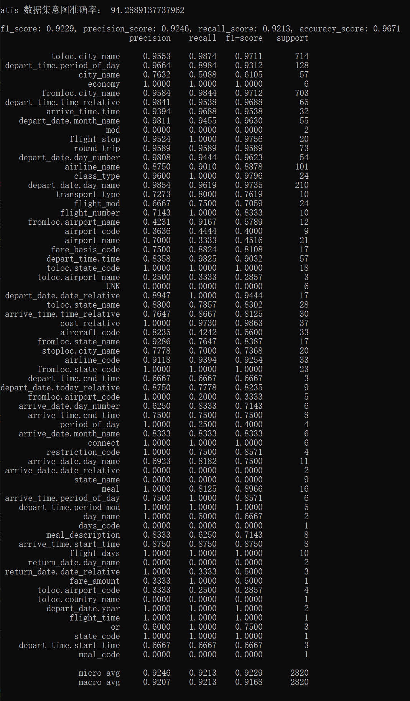
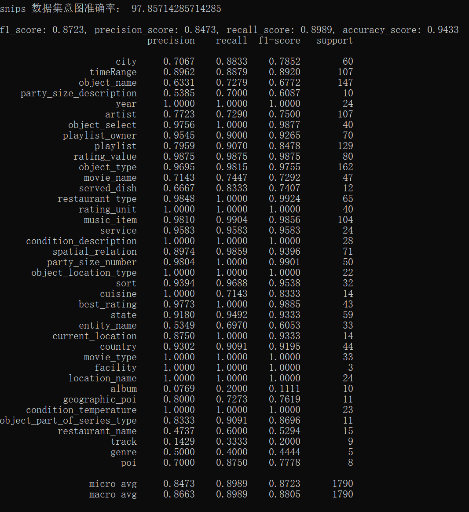

## keras 复现SlotGate-SLU 模型

[Slot-Gated Modeling for Joint Slot Filling and Intent Prediction](https://www.aclweb.org/anthology/N18-2118/)，[官方开源代码](https://github.com/MiuLab/SlotGated-SLU)

这是2018年的一篇论文，我在[这篇文章](https://mp.weixin.qq.com/s/lLSuMW2VvBKQyf_POi-ENA)里作了详细的介绍，这是一个意图识别和槽位填充的联合训练模型，由于还算比较有创新，于是我尝试使用这个模型来跑实验。官方开源代码使用 tf1.4 版本写的，版本较老，另外源代码的代码结构写的比较随意，不适合在实际工作中使用，其次可读性也不强；因此我花了点时间用 keras 来复现了这个模型。

[复现模型时的一些理解看这里](https://mp.weixin.qq.com/s/S11RTpY0XTlob7QhLeZbSQ)

### 如何运行本项目代码

1、下载本仓库代码，进入项目所在文件夹

2、使用脚本 `train.py` 进行训练和评估

```python
# 使用 full_attention 参数确定是否使用 slot attention
# 使用 dataset 参数确定使用哪一个数据集做实验，可选的有 snips 和 atis
# 使用 max_features 参数指定词表大小，snips 数据集建议11250，atis 数据集建议750
python train.py --max_epochs=80 --full_attention=True --dataset=snips --max_features=11250
```


下面两个图分别是我复现的模型在 atis 和 snips 两个数据集上的评估结果，基本上和原论文的实验结果差不多。另外由于我没有使用预训练的词向量，因此embedding 是随机初始化的，在snips数据集上让embedding 的参数可训练，相比于不训练在槽位填充任务上能提升三四个点，而且收敛的更快；我想如果用预训练的词向量效果应该会更好。






